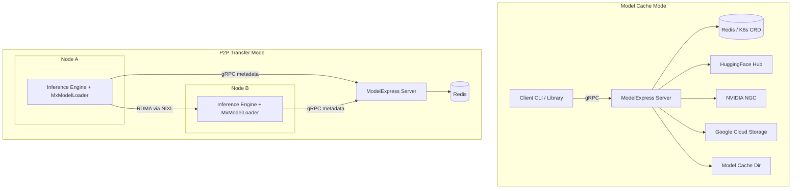
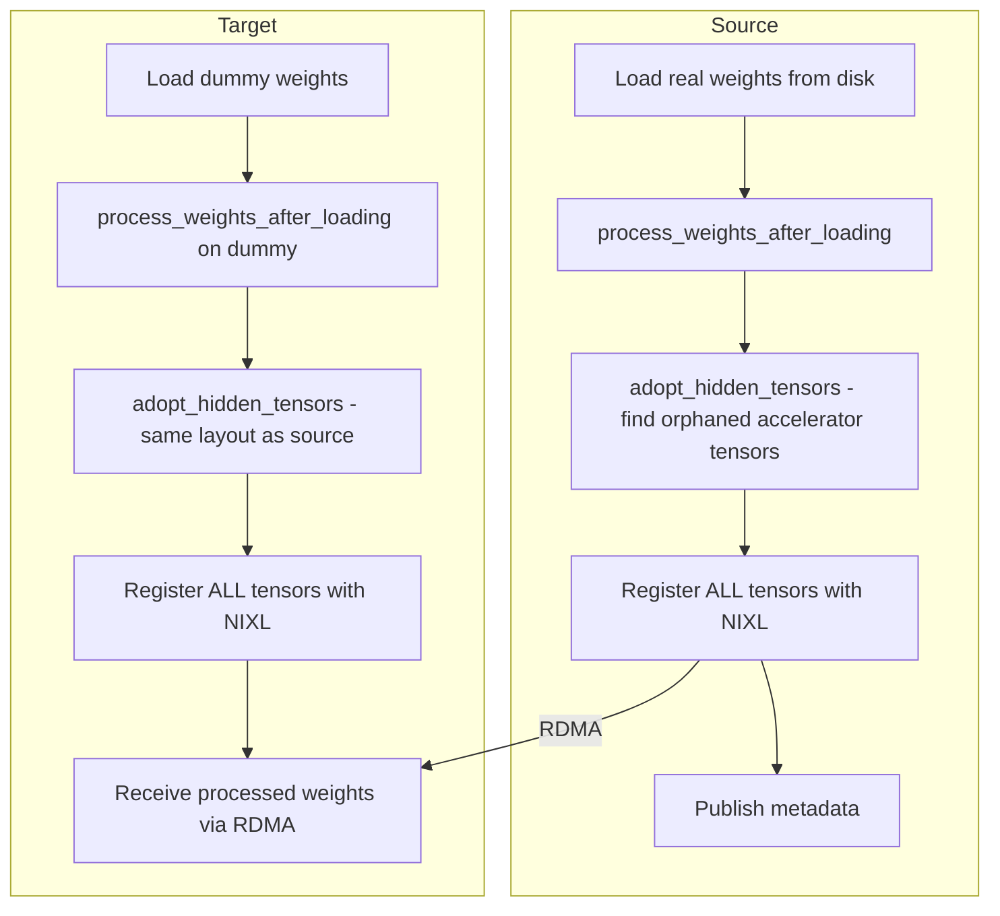

<!--
SPDX-FileCopyrightText: Copyright (c) 2025-2026 NVIDIA CORPORATION & AFFILIATES. All rights reserved.
SPDX-License-Identifier: Apache-2.0
-->

# ModelExpress Architecture

Detailed reference document for the ModelExpress codebase. For deployment and configuration, see [`DEPLOYMENT.md`](DEPLOYMENT.md). For contribution guidelines and dev setup, see [`CONTRIBUTING.md`](../CONTRIBUTING.md). For coding standards and AI assistant instructions, see `CLAUDE.md`. For CLI usage, see [`CLI.md`](CLI.md). For GCS provider internals, see [`GCS_PROVIDER.md`](GCS_PROVIDER.md).

## Project Overview

ModelExpress is a Rust-based model cache management service and GPU-to-GPU model weight transfer system. It serves two roles:

- **Model Cache Service** - A sidecar alongside inference solutions (vLLM, SGLang, NVIDIA Dynamo) that accelerates model downloads from HuggingFace, NGC, and GCS. Model lifecycle state lives in a distributed registry — Redis or Kubernetes CRDs (`ModelCacheEntry`), selected via `MX_METADATA_BACKEND` — so multiple server replicas can coordinate without a shared-filesystem database. LRU cache eviction runs off the same registry.
- **P2P Weight Transfer** - GPU-to-GPU model weight transfers between inference replicas using NVIDIA NIXL over RDMA/InfiniBand, enabling ~15-second transfers for 681GB models. The Python client includes engine adapters for vLLM and SGLang.

### Current Status

| Model | Status | Transfer Time | Notes |
|-------|--------|---------------|-------|
| DeepSeek-V3 (671B, FP8) | Working | ~15s | 681GB across 8 GPUs @ ~45 Gbps per link |
| Llama 3.3 70B | Working | ~5s | 140GB across 8 GPUs @ ~28 Gbps per link |

## Architecture



### Components

| Component | Language | Location | Purpose |
|-----------|----------|----------|---------|
| Server | Rust | `modelexpress_server/` | gRPC server: model downloads, cache eviction, P2P coordination |
| Rust Client | Rust | `modelexpress_client/src/` | Client library and CLI tool |
| Python Client | Python | `modelexpress_client/python/` | Inference engine loaders, NIXL transfer manager, gRPC client |
| Common | Rust | `modelexpress_common/` | Protobuf definitions, shared types, provider trait, config |
| Workspace Tests | Rust | `workspace-tests/` | Integration tests and Criterion benchmarks |

## Repository Structure

```text
ModelExpress/
├── Cargo.toml                          # Workspace root (4 members)
├── Cargo.lock
├── docker/
│   ├── Dockerfile                      # Multi-stage production image
│   ├── Dockerfile.client-wheel         # Builds Python client wheels + sdist
│   └── docker-compose.yml              # Single-service dev setup
├── run_integration_tests.sh            # Integration test runner
├── test_client.sh                      # Client test script
├── test_grpc_transfer_k8s.sh           # K8s gRPC transfer test
├── deny.toml                           # cargo-deny config
├── rust-toolchain.toml                 # Rust version pinning
├── rustfmt.toml                        # Formatting config
├── modelexpress-cli-completion.bash    # Shell completions
│
├── modelexpress_server/
│   ├── Cargo.toml
│   └── src/
│       ├── main.rs                     # Server startup, service registration
│       ├── lib.rs                      # Module exports
│       ├── config.rs                   # ServerConfig, layered loading, validation
│       ├── backend_config.rs           # Shared BackendConfig (Redis / K8s) + env parsing
│       ├── cache.rs                    # CacheEvictionService, LRU policy
│       ├── services.rs                 # Health, API, Model gRPC services + ModelDownloadTracker
│       ├── p2p/
│       │   ├── state.rs                # P2pStateManager wrapper
│       │   ├── service.rs              # P2P gRPC service implementation
│       │   ├── source_identity.rs      # SHA256-based mx_source_id computation
│       │   ├── reaper.rs               # Server-side stale source detection and GC
│       │   ├── k8s_types.rs            # P2P CRD type definitions (ModelMetadata)
│       │   ├── backend.rs              # MetadataBackend trait + types
│       │   └── backend/
│       │       ├── redis.rs            # P2P Redis backend
│       │       └── kubernetes.rs       # P2P Kubernetes CRD backend
│       ├── registry/
│       │   ├── state.rs                # RegistryManager wrapper
│       │   ├── backend.rs              # RegistryBackend trait + ModelRecord
│       │   ├── k8s_types.rs            # ModelCacheEntry CRD type
│       │   └── backend/
│       │       ├── redis.rs            # Redis registry backend
│       │       └── kubernetes.rs       # K8s ModelCacheEntry registry backend
│       └── bin/
│           └── config_gen.rs           # Config file generator/migrator
│
├── modelexpress_client/
│   ├── Cargo.toml
│   └── src/
│       ├── lib.rs                      # Client struct, public API
│       └── bin/
│           ├── cli.rs                  # CLI entry point (modelexpress-cli)
│           ├── test_client.rs          # Concurrent/single download tests
│           ├── fallback_test.rs        # Provider fallback tests
│           └── modules/
│               ├── args.rs             # CLI args (Cli struct, embeds ClientArgs)
│               ├── handlers.rs         # CLI command handlers
│               ├── output.rs           # Output formatting (human, JSON, JSON-pretty)
│               └── payload.rs          # JSON payload reader (inline, file, stdin)
│
├── modelexpress_client/python/
│   ├── pyproject.toml                  # Python package config
│   ├── generate_proto.sh               # Proto stub generation script
│   └── modelexpress/
│       ├── __init__.py                 # Package init, vLLM loader auto-registration
│       ├── client.py                   # MxClient gRPC client
│       ├── nixl_transfer.py            # NixlTransferManager
│       ├── source_selection.py         # P2P source-ordering policies (random, rendezvous_hash)
│       ├── metrics.py                   # Opt-in Prometheus metrics collector (source-selection group today)
│       ├── gds_transfer.py             # GPUDirect Storage transfer support
│       ├── gds_loader.py               # GDS model loader
│       ├── adapter.py                  # EngineAdapter contract and strategy errors
│       ├── vllm_loader.py              # Compatibility shim for engines.vllm.loader
│       ├── metadata/                   # Metadata clients, publishing, heartbeat, worker manifest service
│       │   ├── __init__.py
│       │   ├── artifact_lifecycle.py   # Engine-agnostic cache-artifact lifecycle
│       │   ├── artifact_transfer.py    # Tar/NIXL artifact transfer primitives
│       │   ├── publish.py              # Source identity + metadata publication
│       │   ├── publisher.py            # Source publication and heartbeat signaling
│       │   ├── worker_server.py        # WorkerGrpcServer (P2P tensor/artifact manifests)
│       │   ├── source_id.py            # Python mx_source_id computation
│       │   ├── client_factory.py       # Selects central vs k8s-service metadata client
│       │   └── k8s_service_client.py   # Decentralized k8s-service metadata client
│       ├── load_strategy/              # Loading strategy chain
│       │   ├── __init__.py             # LoadStrategyChain.run()
│       │   ├── context.py              # LoadContext and LoadResult
│       │   ├── base.py                 # LoadStrategy ABC and shared helpers
│       │   ├── rdma_strategy.py        # RdmaStrategy (P2P GPU transfer via NIXL)
│       │   ├── model_streamer_strategy.py # ModelStreamerStrategy (S3/GCS/Azure/local)
│       │   ├── gds_strategy.py         # GdsStrategy (GPUDirect Storage)
│       │   └── default_strategy.py     # DefaultStrategy (engine-native fallback)
│       ├── engines/
│       │   ├── vllm/                   # vLLM integration
│       │   │   ├── __init__.py         # vLLM loader registration
│       │   │   ├── adapter.py          # VllmAdapter and context builder
│       │   │   └── loader.py           # MxModelLoader implementation
│       │   └── sglang/                 # SGLang integration
│       │       ├── __init__.py
│       │       ├── adapter.py          # SglangAdapter and context builder
│       │       └── loader.py           # MxModelLoader for remote_instance backend
│       ├── tensor_utils.py             # Tensor collection, checksums, storage views
│       ├── transfer_safety.py          # MLA feature gate, TransferFingerprint
│       ├── rank_utils.py               # Rank detection utilities
│       ├── vllm_worker.py              # Compatibility worker for older manual registration
│       ├── types.py                    # TensorDescriptor, WorkerMetadata dataclasses
│       ├── p2p_pb2.py                  # Generated protobuf stubs
│       └── p2p_pb2_grpc.py             # Generated gRPC stubs
│
├── modelexpress_common/
│   ├── Cargo.toml
│   ├── build.rs                        # tonic-build: compiles all 4 proto files
│   ├── proto/
│   │   ├── health.proto                # HealthService
│   │   ├── api.proto                   # ApiService
│   │   ├── model.proto                 # ModelService
│   │   └── p2p.proto                   # P2pService
│   └── src/
│       ├── lib.rs                      # Module exports, gRPC stubs, type conversions
│       ├── cache.rs                    # CacheEvictionConfig, LruConfig, DurationConfig
│       ├── client_config.rs            # ClientConfig, ClientArgs (shared CLI args)
│       ├── config.rs                   # Config trait utilities
│       ├── download.rs                 # Download orchestration (smart-fallback, direct, server-only)
│       ├── models.rs                   # Status, ModelProvider, ModelStatus, ModelStatusResponse
│       ├── providers.rs                # ModelProviderTrait definition, re-exports
│       └── providers/
│           ├── gcs.rs                  # GcsProvider implementation
│           ├── gcs/                    # GCS manifest, cache layout, locking, download helpers
│           ├── huggingface.rs          # HuggingFaceProvider implementation
│           └── ngc.rs                  # NgcProvider implementation
│
├── workspace-tests/
│   ├── Cargo.toml
│   ├── tests/
│   │   └── integration_tests.rs        # Health, ping, download, fallback tests
│   └── benches/
│       └── performance.rs              # Criterion: DB ops, serialization benchmarks
│
├── helm/
│   ├── Chart.yaml                      # v0.2.2
│   ├── deploy.sh                       # Deploy script (microk8s/kubectl auto-detect)
│   ├── values.yaml                     # Default (1 replica, 10Gi PVC)
│   ├── values-development.yaml         # Dev (debug, 512Mi)
│   ├── values-production.yaml          # Prod (3 replicas, 2Gi, ingress)
│   ├── values-local-storage.yaml       # Test (no PVC, emptyDir)
│   └── templates/
│       ├── deployment.yaml
│       ├── service.yaml
│       ├── pvc.yaml
│       ├── ingress.yaml
│       └── serviceaccount.yaml
│
├── examples/
│   ├── p2p_transfer_k8s/               # GPU-to-GPU weight transfer example
│   │   ├── README.md
│   │   ├── model-download.yaml         # Model weights download job
│   │   ├── server/
│   │   │   ├── kubernetes_backend/     # CRD-based metadata (crd, rbac, server)
│   │   │   └── redis_backend/          # Redis-based metadata (redis, server)
│   │   └── client/
│   │       ├── vllm/
│   │       │   ├── Dockerfile          # vLLM + ModelExpress client image
│   │       │   ├── vllm-single-node.yaml  # TP-only (DeepSeek-V4-Pro)
│   │       │   └── vllm-multi-node.yaml   # TP+PP (DeepSeek-V4-Pro, 2 nodes)
│   │       └── sglang/
│   │           ├── Dockerfile          # SGLang + ModelExpress client image
│   │           └── sglang-single-node-p2p.yaml
│   ├── model_streamer_k8s/             # ModelStreamer startup examples
│   │   ├── README.md
│   │   └── client/
│   │       └── vllm/
│   │           ├── README.md
│   │           ├── vllm-single-node-streamer-azure.yaml
│   │           ├── vllm-single-node-streamer-s3.yaml
│   │           └── vllm-single-node-streamer-local.yaml
│   ├── crds.yaml                       # ModelMetadata + ModelCacheEntry CRDs (cluster-admin)
│   ├── dynamo_model_cache_k8s/         # Dynamo model-cache serving example
│   │   ├── README.md
│   │   └── agg.yaml
│   └── dynamo_p2p_transfer_k8s/        # Dynamo DGD with P2P weight transfer
│       ├── Dockerfile                   # dynamo vllm-runtime + MX client
│       ├── README.md
│       └── vllm/
│           ├── rbac-modelmetadata.yaml  # ServiceAccount + Role + RoleBinding
│           └── vllm-multi-node-aggregated.yaml  # DGD: MX server + Frontend + VllmWorker
│
├── docs/
│   ├── ARCHITECTURE.md                 # Architecture reference
│   ├── CLI.md                          # CLI tool documentation
│   ├── DEPLOYMENT.md                   # Deployment and configuration guide
│   └── metadata.md                     # Metadata storage and coordination protocol
│
├── .devcontainer/
│   ├── devcontainer.json               # VSCode config: rust-analyzer, port 8001
│   └── Dockerfile                      # Ubuntu 24.04 dev env
│
├── .github/
│   ├── copilot-instructions.md         # GitHub Copilot agent instructions
│   ├── dco.yml                         # DCO enforcement
│   └── workflows/
│       ├── ci.yml                      # CI pipeline
│       └── codeql.yml                  # Security scanning
│
├── .cursor/
│   └── rules/
│       └── rust.mdc                    # Cursor agent instructions
│
├── .pre-commit-config.yaml             # Pre-commit hooks config
└── .coderabbit.yaml                    # CodeRabbit review config
```

## Workspace and Crate Structure

| Crate | Package Name | Type | Binary Targets |
|-------|-------------|------|----------------|
| `modelexpress_server` | `modelexpress-server` | lib + bin | `modelexpress-server`, `config_gen` |
| `modelexpress_client` | `modelexpress-client` | lib + bin | `modelexpress-cli`, `test_client`, `fallback_test` |
| `modelexpress_common` | `modelexpress-common` | lib | (none) |
| `workspace-tests` | `workspace-tests` | test + bench | (integration tests, criterion benchmarks) |

All cargo dependencies are declared in the root `Cargo.toml`. Sub-crates use workspace dependencies exclusively.

## gRPC Services

Four proto files define four services, all compiled via `tonic-build` in `modelexpress_common/build.rs`:

### health.proto - HealthService

| RPC | Request | Response | Purpose |
|-----|---------|----------|---------|
| `GetHealth` | `HealthRequest` | `HealthResponse` | Server version, status, uptime |

### api.proto - ApiService

| RPC | Request | Response | Purpose |
|-----|---------|----------|---------|
| `SendRequest` | `ApiRequest` | `ApiResponse` | Generic API (e.g., "ping" -> "pong") |

### model.proto - ModelService

| RPC | Request | Response | Purpose |
|-----|---------|----------|---------|
| `EnsureModelDownloaded` | `ModelDownloadRequest` | stream `ModelStatusUpdate` | Trigger download, stream progress |
| `StreamModelFiles` | `ModelFilesRequest` | stream `FileChunk` | Stream model file contents (1MB chunks) |
| `ListModelFiles` | `ModelFilesRequest` | `ModelFileList` | List files with sizes |
| `DeleteModel` | `DeleteModelRequest` | `DeleteModelResponse` | Remove a model record from the registry (used by `model clear`) |

Key message types: `ModelProvider` (HuggingFace, NGC, GCS), `ModelStatus` (Downloading, Downloaded, Error), `ModelStatusUpdate`, `FileChunk`.

`EnsureModelDownloaded` verifies that a `DOWNLOADED` registry record still has its files on disk before honoring it as a cache hit. If the files are missing (for example after a `model clear` that only removed local storage), the stale record is deleted and the download is re-claimed so the model is actually re-fetched rather than returning a false success.

### p2p.proto - P2pService

| RPC | Request | Response | Purpose |
|-----|---------|----------|---------|
| `PublishMetadata` | `PublishMetadataRequest` | `PublishMetadataResponse` | Source publishes worker metadata (identity + tensors + backend metadata) |
| `ListSources` | `ListSourcesRequest` | `ListSourcesResponse` | Lightweight listing of available source workers (no tensor data) |
| `GetMetadata` | `GetMetadataRequest` | `GetMetadataResponse` | Fetch full tensor metadata for one specific worker (MB-scale, on demand) |
| `UpdateStatus` | `UpdateStatusRequest` | `UpdateStatusResponse` | Update per-worker lifecycle status (Initializing/Ready/Stale) |

Key message types: `SourceIdentity` (all fields affecting tensor layout compatibility and `mx_source_id`), `WorkerMetadata` (rank, runtime `accelerator`, oneof backend_metadata, tensors, status, P2P endpoint fields), `TensorDescriptor` (name, addr, size, device_id, dtype), `SourceInstanceRef` (lightweight worker reference for listing, including runtime `accelerator` for pre-fetch compatibility filtering).

### p2p.proto - WorkerService (P2P, opt-in)

| RPC | Request | Response | Purpose |
|-----|---------|----------|---------|
| `GetTensorManifest` | `GetTensorManifestRequest` | `GetTensorManifestResponse` | Fetch tensor descriptors directly from a source worker |
| `GetArtifactManifestHeader` | `GetArtifactManifestHeaderRequest` | `GetArtifactManifestHeaderResponse` | Fetch artifact identity, counts, file table, and worker endpoints |
| `GetArtifactManifestChunks` | `GetArtifactManifestChunksRequest` | `GetArtifactManifestChunksResponse` | Fetch artifact chunk metadata pages by `chunk_index` |
| `PrepareArtifactChunk` | `PrepareArtifactChunkRequest` | `PrepareArtifactChunkResponse` | Read one artifact range into source registered DRAM and return a NIXL descriptor lease |
| `ReleaseArtifactChunk` | `ReleaseArtifactChunkRequest` | `ReleaseArtifactChunkResponse` | Release a prepared artifact chunk lease |

Per-worker gRPC service started when `MX_P2P_METADATA=1`, or unconditionally when using a decentralized metadata backend (the backend's client sets `REQUIRES_P2P_METADATA = True` and the env var is ignored). Targets call this instead of fetching tensor descriptors or artifact manifest metadata from the central server. `GetTensorManifestResponse` carries the source worker's runtime `accelerator` value so decentralized targets can apply the same compatibility filter as central metadata mode. Artifact byte transfer still uses NIXL; `PrepareArtifactChunk` only exposes a source-side registered DRAM range for one sealed artifact chunk. `GetTensorManifest` validates both `mx_source_id` and the selected runtime `worker_id` to catch stale discovery records whose endpoint has been reused by a new process. The `worker_id` handshake fields are optional for rolling-upgrade compatibility; generation validation takes effect when the source supports them.

See [`metadata.md`](metadata.md) for the full metadata architecture including storage schemas and coordination protocol.

## Rust Server

### Startup Flow

1. Parse CLI args (`ServerArgs` via clap)
2. Load config (`ServerConfig::load()`) - CLI > env vars > config file > defaults
3. Initialize structured logging (tracing-subscriber)
4. Connect to the model registry backend (`MX_METADATA_BACKEND` — same selector as P2P). Fails fast on connect error.
5. Initialize the process-wide `ModelDownloadTracker` with the registry, seed the `MODEL_TRACKER` OnceLock
6. Start `CacheEvictionService` background task (reads the same registry)
7. Connect to the P2P metadata backend (`MX_METADATA_BACKEND`, Redis or Kubernetes CRD)
8. Start reaper background task for stale source detection and GC
9. Register 4 gRPC services with tonic (max message size: 100MB)
10. Listen on configured address (default `0.0.0.0:8001`)
11. Graceful shutdown on CTRL+C (signals cache eviction service and reaper)

### ServerConfig

```yaml
server:
  host: "0.0.0.0"        # MODEL_EXPRESS_SERVER_HOST
  port: 8001              # MODEL_EXPRESS_SERVER_PORT
cache:
  directory: "./cache"    # MODEL_EXPRESS_CACHE_DIRECTORY
  max_size_bytes: null
  eviction:
    enabled: true         # MODEL_EXPRESS_CACHE_EVICTION_ENABLED
    policy:
      type: lru
      unused_threshold: "7d"
      max_models: null
      min_free_space_bytes: null
    check_interval: "1h"
logging:
  level: info             # MODEL_EXPRESS_LOG_LEVEL
  format: pretty          # MODEL_EXPRESS_LOG_FORMAT
  file: null
  structured: false
```

Distributed backend selection lives outside the YAML, in env vars: `MX_METADATA_BACKEND` (drives both P2P and registry) plus the corresponding connection vars (`REDIS_URL` or `POD_NAMESPACE`). See [`DEPLOYMENT.md`](DEPLOYMENT.md#distributed-backend-selection).

### ModelRegistryBackend (Redis and Kubernetes CRD)

**Redis backend**: single Redis Hash per cached model at `mx:model:{name}` with fields `provider`, `status`, `created_at` (RFC3339), `last_used_at` (RFC3339), and optional `message`. No secondary indexes — LRU ordering and status counts are computed on demand by `SCAN` + pipelined `HGETALL`/`HGET`. Claim, retry, and `set_status` updates use Lua scripts so concurrent readers see either the pre-update record or the complete post-update record, never a partially-written hash.

**Kubernetes CRD backend**: one `ModelCacheEntry` CR per cached model in the server's namespace. `spec.modelName` + `spec.provider` are immutable; `status.{phase,createdAt,lastUsedAt,message}` are patched via the status subresource. Atomicity on the claim path comes from etcd's name-uniqueness on `create` (409 Conflict on the loser). CR names use the shared `sanitize_model_name` with an `mx-cache-` prefix to stay distinct from the P2P `ModelMetadata` CRs.

Key operations on the async `RegistryBackend` trait:

| Method | Redis implementation |
|--------|----------------------|
| `get_status(name)` | `HGET mx:model:{name} status` |
| `set_status(name, provider, status, msg)` | Lua `EVAL` updates status/provider/last_used_at/message atomically and `HSETNX`s `created_at` to preserve the first-write timestamp |
| `try_claim_for_download(name, provider)` | `HSETNX status DOWNLOADING`; winner populates remaining fields without contention |
| `touch_model(name)` | `HSET last_used_at {now}` (gated on `EXISTS` so touch is update-only, never create) |
| `delete_model(name)` | `DEL` |
| `get_models_by_last_used(limit)` | `SCAN mx:model:*` + pipelined `HGETALL` + Rust-side sort |
| `get_status_counts()` | `SCAN mx:model:*` + pipelined `HGET status` + Rust-side tally |

Concurrency: Redis backends use cloned async `ConnectionManager`s behind an `RwLock` for lazy initialization and reconnect caching.

### CacheEvictionService

Runs in a background tokio task on a configurable interval (default 1 hour). LRU eviction policy:

1. Time-based: evict models with `last_used_at` older than `unused_threshold` (default 7 days)
2. Count-based: if total > `max_models`, evict oldest excess
3. Only DOWNLOADED models are eligible for eviction

### P2P Metadata Backends

Two families of backends exist: **server-coordinated** (the server owns the metadata store) and **decentralized** (no central server in the loop).

Server-coordinated backends live in the Rust server and are selected via `MX_METADATA_BACKEND`:

- **Redis** (`redis`): Source index hashes (`mx:source:{source_id}`) with an `__attributes__` field storing `SourceIdentity` and `{worker_id}` fields as presence markers. Worker data stored in separate hashes (`mx:source:{source_id}:{worker_id}`). Stale detection and cleanup handled by the server-side reaper.
- **Kubernetes** (`kubernetes`/`k8s`/`crd`): `ModelMetadata` CRDs (one per worker) with `ConfigMap`s for tensor descriptors. Owner references for automatic garbage collection. Standard Kubernetes `status.conditions` (`Ready`) and `status.observedGeneration` are maintained so that `kubectl wait --for=condition=Ready` works. Stale detection handled by the server-side reaper.

The decentralized backend lives in the Python client and is selected via `MX_METADATA_BACKEND`:

- **K8s-service** (`k8s-service`/`service`): each source pool sits behind a Kubernetes Service (one per tensor-parallel rank, label selector pinned to `mx.rank=R`). Clients open a direct gRPC channel to the Service DNS and call `GetTensorManifest`; kube-proxy load-balances across ready backends. No central server is involved. `mx_source_id` is computed client-side via the same canonical JSON + SHA256 scheme and validated on the response. See [`../examples/k8s_service_sources/`](../examples/k8s_service_sources/) for the deployment shape.

Each worker publishes independently. The `mx_source_id` is a 16-char hex key computed from `SHA256(canonical_json(SourceIdentity))` where `SourceIdentity` includes a `revision` field for content-addressed identity (HuggingFace commit SHA, S3 object version, or a deployer-provided string). When `revision` names immutable content, two sources with identical `mx_source_id` are expected to serve bit-identical weight bytes; the ID itself validates declared identity rather than hashing tensor contents, so the guarantee is only as strong as the revision pin and the local cache being intact. Large u64 values (GPU addresses) are serialized as strings to avoid JSON precision loss.

The Rust and Python implementations of `compute_mx_source_id` are locked together via cross-checked pinned-hash unit tests (`source_identity.rs::test_python_cross_check_*` and `test_source_id.py::test_pinned_hash_*`). Either side drifting on canonical JSON encoding or hashing breaks both test sets together.

See [`metadata.md`](metadata.md) for the full storage layout and schemas.

### k8s-service Metadata Backend

The decentralized `k8s-service` backend lives in the Python client as `MxK8sServiceClient` (duck-typed to `MxClientBase`). Clients open a direct gRPC channel to a Kubernetes Service DNS name and call `GetTensorManifest`; kube-proxy load-balances across ready backends; `mx_source_id` is computed client-side (Python `compute_mx_source_id` matches the Rust implementation via pinned cross-check tests) and validated on every response. This backend currently serves tensor manifests only; file-backed artifact discovery requires a central-coordinator backend (`redis` or `kubernetes`) until `k8s-service` grows an artifact-source discovery path.

**Pattern encoding:** `MX_K8S_SERVICE_PATTERN` supports two shapes:

- Explicit `:port` in the pattern (e.g. `mx-sources-rank-{rank}:6555`) is used verbatim after `{rank}` substitution. Rank encoded in the hostname; one Service per rank with a rank-specific label selector.
- No port in the pattern (e.g. `mx-sources`, the default) triggers auto-append of `:{MX_WORKER_GRPC_PORT + rank}`. Rank encoded in the port; one Service with N named ports, each targeting the matching in-pod `WorkerGrpcServer`.

**Pool constraint:** every ready pod behind a given Service must serve the same `mx_source_id`. Transient revision skew during rolling updates is handled by client-side retry on `FAILED_PRECONDITION` over fresh gRPC channels, up to `MX_K8S_SOURCE_RETRIES`. Workloads that need per-worker addressability (RL rollouts, live fine-tune refits, mixed-version fleets) must use the central-coordinator backends instead; the k8s-service backend's Service-routing model has no way to express "this specific worker."

See [`K8S_SERVICE_BACKEND.md`](K8S_SERVICE_BACKEND.md) for design rationale, limitations, and backend-selection guidance.

### ModelDownloadTracker

Global singleton (`LazyLock<ModelDownloadTracker>`) that coordinates concurrent downloads. Uses `try_claim_for_download()` for race-free model claiming and tokio channels for streaming status updates to multiple waiting clients.

## Rust Client

### Client Public API

The `Client` struct in `modelexpress_client/src/lib.rs` wraps gRPC connections:

| Method | Purpose |
|--------|---------|
| `new(config)` | Create client with config |
| `health_check()` | Call HealthService |
| `ping()` | Call ApiService with "ping" |
| `download_model(name, provider)` | Trigger download via streaming RPC |
| `download_model_direct(name, provider, cache_dir)` | Download directly from provider |
| `ensure_model(name, provider, strategy)` | Smart download with fallback strategy |
| `stream_model_files(name)` | Stream model files from server |
| `list_model_files(name)` | List model files on server |
| `delete_model(name, cache_dir)` | Delete cached model |
| `validate_model(name, cache_dir)` | Validate cached model integrity |

### Download Strategies

| Strategy | Behavior |
|----------|----------|
| `SmartFallback` | Try server first, fall back to direct download on failure |
| `ServerOnly` | Only download through the server |
| `DirectOnly` | Only download directly from provider |

### CLI (modelexpress-cli)

The `Cli` struct in `args.rs` embeds `ClientArgs` via `#[command(flatten)]`. Commands:

| Command | Purpose |
|---------|---------|
| `health` | Check server health |
| `ping` | Ping server |
| `model download <name>` | Download a model |
| `model list-files <name>` | List model files |
| `model clear <name>` | Delete cached model |
| `model validate <name>` | Validate model integrity |

Output formats: `--format human` (default), `--format json`, `--format json-pretty`.

## Common Library

### Modules

| Module | Purpose |
|--------|---------|
| `cache` | `CacheEvictionConfig`, `LruConfig`, `DurationConfig` (used by both server and client configs) |
| `client_config` | `ClientConfig` + `ClientArgs` shared struct for CLI argument handling |
| `config` | Config trait utilities |
| `download` | Download orchestration with strategy pattern |
| `models` | `Status`, `ModelProvider`, `ModelStatus`, `ModelStatusResponse` |
| `providers` | `ModelProviderTrait` + `HuggingFaceProvider` + `NgcProvider` + `GcsProvider` |
| `grpc` | Generated tonic stubs for all 4 services |
| `constants` | `DEFAULT_GRPC_PORT` (8001), `DEFAULT_TIMEOUT_SECS` (30), `DEFAULT_TRANSFER_CHUNK_SIZE` (32KB) |

### ModelProviderTrait

```rust
#[async_trait]
pub trait ModelProviderTrait: Send + Sync {
    async fn download_model(&self, name: &str, cache_path: Option<PathBuf>, ignore_weights: bool) -> Result<PathBuf>;
    async fn delete_model(&self, name: &str, cache_dir: PathBuf) -> Result<()>;
    async fn get_model_path(&self, name: &str, cache_dir: PathBuf) -> Result<PathBuf>;
    fn provider_name(&self) -> &'static str;
    fn is_ignored(filename: &str) -> bool;
    fn is_image(path: &Path) -> bool;
    fn is_weight_file(filename: &str) -> bool;
}
```

Three implementations:
- `HuggingFaceProvider` - uses the `hf-hub` crate with high-CPU download mode.
- `NgcProvider` - downloads from NVIDIA NGC via the files-manifest endpoint `…/v2/org/{org}[/team/{team}]/{type}/{name}/{version}/files` (no `versions/` segment), which returns self-authenticating presigned URLs paired with relative paths for every file, for both V1 and V2 storage and both org and team scopes (so nested paths and downloads need no per-file URL construction or Authorization forwarding). Falls back to `checksums.blake3` manifest enumeration against the versioned `…/versions/{version}/files` endpoint (Bearer-authenticated `/files/{path}` downloads) when the listing returns 400/401, as some UAM-gated orgs (e.g. the `nim` catalog) do. Resolves the NGC API key from `NGC_API_KEY`, `NGC_CLI_API_KEY`, or `~/.ngc/config`.
- `GcsProvider` - downloads objects under a full `gs://<bucket>/<object-prefix>` URL using Google Application Default Credentials. It writes a `.mx/manifest.json` cache manifest, verifies downloaded files with GCS CRC32C checksums, skips dotfiles, README, and images, and stores models under `<cache>/gcs/<bucket>/<object-prefix>`. See [`GCS_PROVIDER.md`](GCS_PROVIDER.md) for the detailed design.

### ClientConfig / ClientArgs

`ClientArgs` is the single source of truth for shared CLI arguments. `Cli` embeds it via `#[command(flatten)]`.

Loading precedence: CLI args > environment variables > config file > defaults.

## Python Client

### Modules

| Module | Purpose |
|--------|---------|
| `__init__.py` | Package init, exports `register_modelexpress_loaders()` for callers to register the `modelexpress` and `mx` loaders with vLLM |
| `client.py` | `MxClient` - gRPC client wrapping `PublishMetadata`, `ListSources`, `GetMetadata`, and `UpdateStatus` RPCs |
| `accelerators/` | `AcceleratorBackend` boundary for accelerator-specific torch device control and fast-path capability gates, split into `base.py` (protocol), `cuda.py` (`CudaAcceleratorBackend`), and `xpu.py` (`XpuAcceleratorBackend`). CUDA and XPU are implemented backends; XPU keeps CUDA-only fast paths (pool registration, VMM arena, GDS) disabled and falls back to generic per-tensor NIXL registration. Further backends can be added behind the same interface |
| `nixl_transfer.py` | `NixlTransferManager` - NIXL agent lifecycle, tensor registration, RDMA transfers |
| `gds_transfer.py` | GPUDirect Storage availability check and transfer utilities |
| `gds_loader.py` | `MxGdsLoader` - GDS-based model loader (direct file-to-GPU) |
| `adapter.py` | `EngineAdapter` lifecycle hooks and strategy retry errors |
| `vllm_loader.py` | Compatibility shim for `modelexpress.engines.vllm.loader` |
| `metadata/` | Metadata publishing, source identity, heartbeat, worker manifest serving, metadata client selection, and engine-agnostic cache-artifact transfer |
| `load_strategy/` | Engine-neutral loading strategy chain: `RdmaStrategy`, `ModelStreamerStrategy` (S3/GCS/Azure/local), `GdsStrategy`, `DefaultStrategy` |
| `engines/vllm/` | `VllmAdapter` and `MxModelLoader` - maps strategy hooks to vLLM loader APIs and post-load lifecycle |
| `engines/sglang/` | `SglangAdapter` and `MxModelLoader` - maps strategy hooks to SGLang's `remote_instance` backend |
| `tensor_utils.py` | Tensor collection, checksums, storage views, `capture_tensor_attrs` |
| `rank_utils.py` | `get_global_rank`, `get_worker_rank` |
| `vllm_worker.py` | `ModelExpressWorker` - compatibility worker class for older manual-registration workflows |
| `types.py` | `TensorDescriptor`, `WorkerMetadata`, `GetMetadataResponse` dataclasses |
| `p2p_pb2.py` / `p2p_pb2_grpc.py` | Generated protobuf/gRPC stubs |

### MxClient

gRPC client wrapping the P2P service stubs:

| Method | Purpose |
|--------|---------|
| `publish_metadata(identity, worker, worker_id)` | Publish worker metadata; returns `mx_source_id` |
| `list_sources(identity, status_filter)` | List available source workers (lightweight, no tensor data) |
| `get_metadata(mx_source_id, worker_id)` | Fetch full tensor metadata for one worker (on demand) |
| `update_status(mx_source_id, worker_id, worker_rank, status)` | Update worker lifecycle status (e.g., `READY`) |
| `close()` | Close the underlying gRPC channel |

### NixlTransferManager

Manages a NIXL agent and RDMA transfers for a single GPU worker:

| Method | Purpose |
|--------|---------|
| `__init__(agent_name, device_id, listen_port, accelerator_backend)` | Create NIXL agent with UCX backend; `listen_port` enables P2P listen thread; `accelerator_backend` owns torch device operations and accelerator capability gates |
| `register_tensors(tensors)` | Register GPU tensors for RDMA, return serialized metadata. With `MX_POOL_REG=1` on a backend that supports pool registration, registers each unique cudaMalloc allocation backing the tensors instead of registering each tensor individually |
| `register_arena(arena, tensors)` | Register the used VMM arena range once through dmabuf when the active accelerator backend supports the VMM arena fast path, then publish every tensor descriptor against that single MR |
| `fetch_remote_and_wait(agent_name, ip, port)` | P2P: fetch remote NIXL metadata via listen thread (polls until loaded) |
| `receive_from_source(source_metadata, source_tensors, ..., remote_agent_name)` | Execute RDMA read transfer; `remote_agent_name` skips `add_remote_agent` (P2P) |
| `shutdown()` | Clean up NIXL agent and resources |

**Optional NIC pinning.** `MX_RDMA_NIC_PIN=auto` probes PCIe topology at agent init and pins `UCX_NET_DEVICES` to a NUMA-local IB NIC per worker. Workaround for [openucx/ucx#11259](https://github.com/openucx/ucx/issues/11259); see [`docs/DEPLOYMENT.md`](DEPLOYMENT.md) for details.

### vLLM Loader

**MxModelLoader** (extends `BaseModelLoader`, registered as `--load-format modelexpress`; `mx` alias):

Thin orchestration layer that delegates to `LoadStrategyChain.run()`. Builds a `LoadContext` from vLLM config, initializes the model, runs the strategy chain, and updates global registries.

**MTP two-pass load.** Multi-token-prediction models (Qwen3.5 MTP, DeepSeek MTP) call the loader twice on one worker: the target, then the draft head. `_is_speculative_draft()` detects the second pass via `model_config.runner_type == "draft"` and sets `ctx.p2p_enabled = False`. A P2P draft would collide on the target's NIXL metadata port, and since the merged draft shares the target's `SourceIdentity` it could poison source discovery, so registration, publication, and RDMA stay off for the draft while the target keeps serving. The draft loads through the ModelStreamer/default path. To avoid re-reading the whole checkpoint for a small head, `build_model_streamer_weight_iter` streams only the shards holding the draft's tensors: it reads `model.safetensors.index.json` (locally, or via the runai streamer's `pull_files` for object storage) and keeps shards whose tensor names start with `mtp.`. The draft's embedding and `lm_head` come from the target, so they are not streamed. If there is no index or no draft shard, it streams every shard.

### SGLang Loader

**MxModelLoader** is instantiated by SGLang's `remote_instance` loader when
`--remote-instance-weight-loader-backend modelexpress` is used. SGLang
initializes the model, then delegates to this loader. The loader builds a
`LoadContext` from SGLang config and dispatches by `modelexpress-config`
transport. For `transport=nixl`, it runs `LoadStrategyChain.run()` and updates
global registries. For `transport=transfer_engine`, it uses SGLang's initialized
TransferEngine and ModelExpress metadata directly: first replica loads natively,
registers TransferEngine memory, and publishes its session; later replicas
discover that source and pull with `batch_transfer_sync_read`.
`SglangAdapter` owns SGLang-specific rank/device mapping, native fallback
loading, quantized-weight post-processing, and tensor discovery, including the
storage-view naming used for non-contiguous SGLang parameters.
The SGLang side does not expose separate source and target modes; transport
selection and source discovery remain inside the ModelExpress package.

**LoadStrategyChain** (`load_strategy/`):

Auto-detects the best loading strategy with a prioritized chain. Each strategy is a subclass of `LoadStrategy` (ABC) with `is_available(ctx)` and `load(result, ctx)` methods. Engine-specific work is delegated to `ctx.adapter`; `LoadResult` carries the value returned to the engine plus the model used for tensor discovery and publication. The chain filters to eligible strategies and runs them in order until one succeeds:

| Priority | Strategy | `is_available()` | Behavior |
|---|---|---|---|
| p0 | `RdmaStrategy` | NIXL available | `ListSources(READY)`, filter by `worker_rank` and runtime `accelerator`, order the survivors via the configured `SourceSelector` (`MX_P2P_SOURCE_SELECTOR`: `random` default or `rendezvous_hash`), then try candidates (max 3). Filtering before the retry slice prevents incompatible sources from exhausting the retry budget; a post-`GetMetadata` accelerator check remains as defense-in-depth. Before preparing target tensors, P2P sources must serve a manifest for the selected runtime `worker_id`; generation mismatches and transfer failures retry the next candidate, reinitializing the target first when it may have been mutated. |
| p1 | `ModelStreamerStrategy` | `MX_MODEL_URI` set + `runai_model_streamer` installed | Stream safetensors to GPU via CPU staging buffer. `MX_MODEL_URI` accepts remote URIs (`s3://`, `gs://`, `az://`), absolute local paths, or HF model IDs (resolved via `HF_HUB_CACHE`). All storage backends (S3, GCS, Azure) included by default. |
| p2 | `GdsStrategy` | Active accelerator backend supports GDS and GDS hardware is available | Load via `MxGdsLoader` (direct file-to-GPU). Falls through on failure. Reads full checkpoint tensors and slices for TP downstream — see [GDS Reads Full Checkpoint Tensors Under TP](#gds-reads-full-checkpoint-tensors-under-tp). |
| p3 | `DefaultStrategy` | Engine native fallback loader available | Native loader fallback (for vLLM, `DefaultModelLoader`, CPU-staged, auto-downloads from HF Hub). |

Strategies handle the loading path and NIXL tensor registration. `LoadContext.accelerator_backend` centralizes accelerator-specific torch operations and capability gates for fast paths such as pool registration, VMM arena registration, and GDS. Backends that do not support those CUDA-specific paths, such as XPU, leave the gates disabled and use the generic fallback path. XPU transfer deployments still require a UCX/NIXL runtime that can register XPU device memory. Adapter hooks handle engine lifecycle such as vLLM `process_weights_after_loading`, and the chain performs best-effort metadata publication after a successful strategy. New strategies can be added by creating a new file in `load_strategy/` and registering it in `LoadStrategyChain.run()`.

### Source Selection

After `RdmaStrategy` filters listed READY sources to the target's `worker_rank` and to a compatible runtime `accelerator`, it ranks the surviving candidates through a `SourceSelector` (`source_selection.py`) before slicing to `MAX_SOURCE_RETRIES`. Selectors are scoring-based: `ScoredSelector` subclasses implement `score(candidate, context)` and the base orders by descending score. Two policies ship today, resolved by name through a small registry (`MX_P2P_SOURCE_SELECTOR`, default `random`, unknown values fall back to `random`):

- `random` — behavior-preserving default; shuffles with a local RNG so it does not perturb process-global state.
- `rendezvous_hash` — stateless deterministic spreading via HRW hashing of the target identity plus each candidate identity. Different targets get different first choices without a shared counter or server coordination, it is stable across process restarts (blake2b, not Python's salted `hash()`), and adding/removing one source perturbs only a fraction of rankings.

The selector controls ordering only; `RdmaStrategy` enforces the fixed three-candidate retry budget. Selectors read the few fields they need (`worker_rank`, `worker_id`, `identity.model_name`) directly off the live `LoadContext`, so there is no parallel context type. Load- and topology-aware policies are deferred (they need signals such as per-source load or node/rack topology); the same scoring interface accepts them as drop-ins. Selection decisions are emitted as structured logs, and an opt-in Prometheus collector (`metrics.py`, `MX_METRICS_ENABLED=1`) re-emits them as `mx_p2p_*` metrics for benchmarking different schemes.

#### Selection efficacy (measured)

The two Phase 1 policies were compared two ways. An offline simulation drives the real selector code over synthetic `(target, source)` identity sets; because the score depends only on identity and policy (not on hardware or RDMA), it reproduces the on-cluster `mx_p2p_source_selections_total` distribution without standing up transfers. Across M sources / N targets configs (4×20, 4×40, 8×32), **first-choice balance is equivalent** for both policies (both are uniform hashes — max-source share within a few percent of each other and of the `ceil(N/M)/N` ideal). The difference is elsewhere: `rendezvous_hash` has **0% re-pick churn** on a repeated, unchanged source set (vs `random`'s ~`(M-1)/M`), and removing one source changes only ~`1/M` of the unaffected targets' picks.

On-cluster (8×B200 nodes, InfiniBand RDMA; vLLM `--load-format modelexpress`, TP=1, central-coordinator backend), both policies were run against pre-warmed source pools that grow as targets become sources. Across Qwen2.5-0.5B (0.99 GB) and Qwen2.5-7B (~15 GB), 42 real cross-node NIXL RDMA transfers completed and **bandwidth was policy-independent** (~180 Gbps for the 0.5B transfers, ~211 Gbps for the larger 7B transfers as setup amortizes). So `rendezvous_hash`'s win is determinism and low disruption at no balance or bandwidth cost; the deferred `load_aware` policy is what closes the live-fan-out gap where deterministic hashing can pile onto an always-present source.

### Transfer Safety

`RdmaStrategy.is_available()` calls `transfer_safety.check_transfer_allowed()` before attempting P2P transfer. The function logs the model's detected features (attention type, quantization, MoE) and currently allows all combinations — no feature is blocked. The function is kept as a hook for future safety gates.

NVFP4 MoE models (known case: Kimi-K2.5-NVFP4) previously produced corrupted inference after RDMA transfer despite all registered tensor bytes matching. This is a specific instance of a broader class of bugs: post-processing stashes computed state on non-Module objects (e.g. `FusedMoEQuantConfig.a1_gscale = 1/activation_scale` on the quant method), which is invisible to `named_parameters()`/`named_buffers()`. On the target those values are computed from dummy weights before RDMA, and RDMA only overwrites the registered tensors, so the stashed values stay wrong. The fix (`adopt_hidden_tensors()`) recursively scans module attributes for orphaned accelerator tensors (via `is_accel_tensor()`) and registers them as non-persistent buffers so they are included in the RDMA manifest. Verified correct on vLLM v0.17.1 and v0.19.0 with Kimi-K2.5-NVFP4 and on DeepSeek-V3 (MLA + FP8).

During transfer, `ManifestMismatchError` is raised if source and target tensor names or sizes don't match (a likely symptom of a rolling update where pods run different image versions). The receive path converts it, like any receive failure, into a `SourceTransferError`. Before trying the next ranked source, `RdmaStrategy` clears its NIXL state and uses the engine adapter to replace a possibly mutated model with a fresh instance. If the final transfer fails after mutation, the outer strategy chain performs the same cleanup before falling through to the next strategy.

After loading by any strategy, the worker starts a `PublisherThread` that owns initial publication retry and then periodically sends `UpdateStatus(READY)` to keep `updated_at` fresh. On clean shutdown, the publisher sends `UpdateStatus(STALE)` via an `atexit` handler. Metadata publish failures are logged and retried in the publisher thread instead of crashing the worker.

Each GPU worker generates a unique `worker_id` (`uuid4().hex[:8]`) at init and publishes independently. Workers use `torch.distributed.get_rank()` as their global rank (captures both TP and PP position).

### Tensor Discovery

The loader uses `iter_module_tensors()` (in `tensor_utils.py`) to walk the full PyTorch module tree via `named_parameters()` and `named_buffers()`, keeping tensors accepted by the active `AcceleratorBackend.is_accel_tensor()` predicate after post-processing. `CudaAcceleratorBackend` and `XpuAcceleratorBackend` are the concrete backends today, so collection targets CUDA or XPU tensors depending on the active backend. This discovers three categories:

| Category | Source | Example |
|----------|--------|---------|
| Parameters | `named_parameters()` | `layers.0.attention.weight` |
| Buffers | `named_buffers()` | Batch norm running mean |
| Promoted tensor attributes | non-persistent buffers added by `capture_tensor_attrs()` / `adopt_hidden_tensors()` | FP8 `weight_scale`, `_k_scale` |

This is more thorough than `named_parameters()` alone, which only finds parameters and would miss tensors created during `process_weights_after_loading()`. Those bare-attribute tensors are surfaced by promoting them to non-persistent buffers (see below) before discovery, so `named_buffers()` then includes them. Non-contiguous tensors (e.g. MLA's `W_UV` and `W_UK_T` sharing a dequantized intermediate) are registered as flat byte views of their underlying storage via `storage_view()`. Multiple views into the same storage are deduplicated by `data_ptr()` so tied weights are only transferred once.

Two mechanisms promote tensors that `named_parameters()`/`named_buffers()` would otherwise miss, both gated on `is_accel_tensor()`:

- `capture_tensor_attrs()` wraps `process_weights_after_loading()` and intercepts bare accelerator tensors assigned directly as module attributes, registering each as a non-persistent buffer.
- `adopt_hidden_tensors()` recursively scans each module's non-Module attributes for accelerator tensors stashed on plain Python objects (e.g. `FusedMoEQuantConfig.a1_gscale`, FlashInfer workspace buffers) and registers them as non-persistent buffers so they appear in the manifest. Without this, the target's quant method objects retain values computed from dummy weights, causing incorrect inference despite all registered tensor bytes matching.

### VMM Arena (CUDAPluggableAllocator hook)

`MX_VMM_ARENA=1` installs a `CUDAPluggableAllocator` that routes every CUDA allocation issued during `initialize_model`, `load_weights`, and `process_weights_after_loading` into a CUDA VMM arena. The arena reserves 16.0 TiB of virtual address space up front via `cuMemAddressReserve`. The reservation consumes VA only. Physical memory is committed later, one PyTorch allocator call at a time, when the backend creates and maps a VMM handle.

The `modelexpress.vmm` subpackage implements the arena (see `modelexpress_client/python/modelexpress/vmm/README.md` for the user-facing overview):

| Module | Role |
|--------|------|
| `vmm/arena.py` | `VmmArena` reserves the large VA range, bump-assigns each `mx_malloc` a stable address, tracks live allocations by VA, and exposes the used high-water range for registration |
| `vmm/backend.py` | `CudaVmmBackend` implements the CUDA VMM calls: reserve VA, `cuMemCreate`, `cuMemMap`, `cuMemSetAccess`, `cuMemUnmap`, `cuMemRelease`, and reserve release. Each allocation rolls back cleanly if a later CUDA call fails |
| `vmm/hook.py` + `vmm/_alloc_ext.cpp` | `use_arena` combines `torch.cuda.use_mem_pool` with the C extension's `mx_malloc` and `mx_free` shims. The C extension is built best-effort by `setup.py`; if compilation fails the install still succeeds, `vmm.ARENA_AVAILABLE` is `False` at runtime, and the loader logs a warning and falls back when `MX_VMM_ARENA=1` is requested |
| `vmm/runtime.py` | Engine-agnostic lifecycle helpers: `maybe_enter_vmm_arena(ctx)` is the contextmanager each engine adapter wraps around its load envelope (env-var handling, per-device arena dict, `use_arena` wrapping). `log_arena_post_load(ctx)` emits a diagnostic line after the load body returns |

The allocation model matches PyTorch's caching allocator boundary. PyTorch already groups tensors into allocator segments before it calls the plugin, so ModelExpress gives each plugin allocation its own VMM physical handle instead of sub-allocating again inside larger chunks. `mx_malloc(size)` rounds to CUDA VMM granularity, calls `cuMemCreate`, maps that handle at the next arena VA, and returns the mapped address. `mx_free(ptr)` looks up the allocation, calls `cuMemUnmap`, then `cuMemRelease`, so selective frees during post-processing return physical memory before NIXL registration.

After the load strategy succeeds and the engine has finished post-processing, `LoadStrategyChain` registers the arena instead of registering tensors one by one. `register_arena` calls `cuMemGetHandleForAddressRange` over `[arena.base, arena.base + arena.used_bytes)`, then performs one dmabuf-backed registration for the used range. Tensor descriptors still list every tensor by name and offset, but all offsets share one lkey from the arena MR.

The arena path does not require `MX_POOL_REG=1`. Pool-reg remains the optimization for normal cudaMalloc deployments. Arena deployments use the direct `register_arena` seam because they already know the contiguous VA range and do not need `cuMemGetAddressRange` to rediscover allocation boundaries.

Empirical validation on B200 + ConnectX on 2026-05-14 showed that a dmabuf MR over a multi-handle VMM range remains valid when holes exist inside the registered VA range. That is the property that lets `process_weights_after_loading` allocate replacement tensors, free discarded tensors, and still finish with one MR for the surviving used arena range.

## NIXL Integration

### What is NIXL?

NIXL (NVIDIA Interconnect eXchange Library) provides zero-copy GPU-to-GPU RDMA transfers on top of UCX:

| Concept | Description |
|---------|-------------|
| **Agent** | NIXL instance managing one GPU's memory registrations and transfers |
| **Memory Registration** | GPU memory must be registered before RDMA access; generates rkeys |
| **Metadata** | Serialized agent info (address, rkeys) shared between source/target |
| **Transfer Descriptor** | Prepared list of (addr, size, device) for bulk transfer |
| **rkey** | Remote key - RDMA authorization token for remote memory access |

### How ModelExpress Uses NIXL

```python
# 1. Create NIXL agent (one per GPU worker)
from nixl._api import nixl_agent, nixl_agent_config
config = nixl_agent_config(backends=["UCX"])
agent = nixl_agent("worker-0", config)

# 2. Register GPU tensors for RDMA access
tensors = [(tensor.data_ptr(), tensor.numel() * tensor.element_size(), device_id, "")]
agent.register_memory(tensors, "VRAM")  # NIXL accelerator memory segment

# 3. Get metadata for remote agent connection
metadata = agent.get_local_md()  # Share this with target

# 4. On target: connect to source and transfer
agent.add_remote_agent("source-worker-0", source_metadata)
src_descs = agent.prep_xfer_dlist("source-worker-0", source_tensors, "VRAM", ["UCX"])
dst_descs = agent.prep_xfer_dlist("", local_tensors, "VRAM", ["UCX"])
handle = agent.make_prepped_xfer("READ", dst_descs, indices, src_descs, indices, ["UCX"])
agent.transfer(handle)

# 5. Wait for completion
while agent.check_xfer_state(handle) not in ("DONE", "SUCCESS"):
    time.sleep(0.001)
agent.release_xfer_handle(handle)
```

## FP8 Model Handling (DeepSeek-V3)

vLLM's `process_weights_after_loading()` transforms model weights into kernel-friendly formats (FP8 scale repacking, NVFP4 padding/swizzling, MLA dequantized projections) and may create new tensors as bare attributes, buffers, or on quant method objects.

The solution: both source and target run `process_weights_after_loading()` first, then `adopt_hidden_tensors()` discovers any accelerator tensors on non-Module objects (quant configs, kernel objects), and finally `register_tensors()` collects everything for RDMA. The target runs post-processing on dummy data to establish the correct tensor layout, receives the real data via RDMA, and all state (including hidden quant config tensors) is correct.



## Coordination Protocol

### Flow

1. **Source loads**: Loads weights from storage (S3/GCS/Azure/local via ModelStreamer, GDS, or disk), runs `process_weights_after_loading()`
2. **Source publishes**: Registers tensors with NIXL, or prepares a sealed cache artifact bundle, then a `PublisherThread` calls `PublishMetadata(identity, worker, worker_id)` -> gets `mx_source_id` (status=INITIALIZING). `WorkerMetadata.accelerator` records runtime accelerator family for compatibility filtering; it is not part of `SourceIdentity` or the source-id hash. In P2P mode (`MX_P2P_METADATA=1`, or auto-forced on by decentralized backends like `k8s-service`), publishes only lightweight endpoint pointers and starts a `WorkerGrpcServer` for tensor manifests or artifact manifest/chunk serving.
3. **Publisher heartbeats**: `PublisherThread` sends `UpdateStatus(READY)` every 30s after publication succeeds, refreshing `updated_at`
4. **Target discovers**: Calls `ListSources(identity, status=READY)`, which returns only READY workers whose `updated_at` is still within `MX_HEARTBEAT_TIMEOUT_SECS`, then filters by `worker_rank` and compatible runtime `accelerator`
5. **Target fetches on demand**: Calls `GetMetadata(mx_source_id, worker_id)` for the chosen candidate. Accelerator-incompatible sources were already dropped using `SourceInstanceRef.accelerator`; this step re-checks the authoritative `WorkerMetadata.accelerator` as defense-in-depth. Empty accelerator metadata is accepted for backward compatibility. If `worker_grpc_endpoint` is populated, the target fetches the tensor manifest before target preparation and requires the endpoint to confirm the selected runtime `worker_id`. The prefetched manifest is reused during transfer; NIXL metadata is fetched via the source listen thread.
6. **Target transfers**: Executes RDMA reads from source; for cache artifacts, it prepares one source chunk lease at a time, receives into target registered DRAM, verifies CRC32C, writes to target-local staging, releases the lease, then installs the staged tar into the runtime cache directory. Generation mismatches and transfer failures try the next candidate (max 3); a possibly mutated target is reinitialized before retry.
7. **Target becomes source**: After receiving weights or installing a cache artifact, publishes own metadata and starts its own heartbeat
8. **Stale detection**: Server-side reaper marks workers STALE if `updated_at` > 90s old; `ListSources(READY)` also applies this heartbeat freshness check at query time so expired READY records are not returned while waiting for the next reaper pass. GC deletes STALE workers after 1 hour

Cache artifact checksums protect transfer integrity but do not authenticate the
source or attest the contents. TorchInductor, Triton, DeepGEMM, TileLang, CuTe
DSL, and FlashInfer caches may
contain executable code, so artifact transfer must be limited to trusted
replicas and a trusted MX server, with MX and worker gRPC endpoints isolated
from untrusted networks. ModelExpress does not currently sign cache artifacts.

See [`metadata.md`](metadata.md) for the full storage schema and debugging guide.

## Environment Variables

### ModelExpress Configuration

| Variable | Default | Description |
|----------|---------|-------------|
| `MX_SERVER_ADDRESS` | `localhost:8001` | gRPC server address (recommended) |
| `MODEL_EXPRESS_URL` | `localhost:8001` | Deprecated, pending removal in a future release. Still read by all client paths and takes precedence when both are set; keep setting it during the transition. |
| `MX_DISABLE_PATCHES` | `0` | Emergency escape hatch that skips all runtime compatibility patches. Set to `1`, `true`, `yes`, or `on` if a patch is incompatible with the installed engine. |
| `MX_METADATA_BACKEND` | (required on server; `""` on client) | Server: `redis` or `kubernetes`. Client: `""` / `server` / `redis` / `kubernetes` (central server) or `k8s-service` (decentralized via K8s Service routing) |
| `MX_POOL_REG` | `0` | Discover cudaMalloc allocations via `cuMemGetAddressRange` and register each as a single NIXL block instead of registering tensors individually. Reduces NIXL registration count by 80-99% on typical vLLM models, cutting `ibv_reg_mr` time and metadata blob size; transfer semantics unchanged. Not required for `MX_VMM_ARENA=1`, which registers the arena directly |
| `MX_VMM_ARENA` | `0` | Install a `CUDAPluggableAllocator` that routes weight-loading allocations into a CUDA VMM arena, then registers the used arena range once through dmabuf at end-of-load. Reserves 16.0 TiB of VA by default and commits physical memory only for mapped allocations. See [VMM Arena](#vmm-arena-cudapluggableallocator-hook) |
| `UCX_CUDA_COPY_REG_WHOLE_ALLOC` | (UCX default) | Set to `off` with `MX_VMM_ARENA=1` until the upstream UCX `cuda_copy_md` length-truncation fix ships. |
| `MX_P2P_METADATA` | `1` | Enable P2P metadata exchange on source workers. Set to `0` to publish full metadata through a central-coordinator backend; ignored on decentralized backends that require P2P metadata |
| `MX_METADATA_PORT` | `5555` | Base NIXL listen port; effective port is `MX_METADATA_PORT + device_id` |
| `MX_WORKER_GRPC_PORT` | `6555` | Base worker gRPC port for P2P tensor and artifact manifest serving; effective port is `MX_WORKER_GRPC_PORT + device_id` |
| `MX_WORKER_HOST` | (auto-detect) | Override worker IP/hostname for P2P endpoints |
| `MX_ARTIFACT_TRANSFER` | `0` | Opt in to cache artifact transfer. The vLLM loader uses it for torch compile, Triton, DeepGEMM, TileLang, CuTe DSL, and FlashInfer JIT caches, including persistent autotune files when supported by vLLM. The SGLang NIXL loader uses it for compatible torch compile, Triton, DeepGEMM, TileLang, CuTe DSL, and FlashInfer caches. Requires the P2P metadata path; if `MX_P2P_METADATA=0`, the loader logs a warning and skips artifact transfer |
| `MX_ARTIFACT_BUNDLE_ROOT` | `$TMPDIR/modelexpress-artifacts` | Staging root for tarred cache artifact bundles |
| `MX_ARTIFACT_READY_URL` | Framework default | Readiness endpoint polled by the artifact publisher before preparing and publishing cache bundles. Defaults to `http://127.0.0.1:8000/health` for vLLM and `http://127.0.0.1:30000/health` for SGLang. Kubernetes StatefulSet workers using their framework's default localhost URL infer pod-0's stable DNS endpoint |
| `MX_ARTIFACT_READY_TIMEOUT_SECS` | `1800` | Maximum time the artifact publisher waits for readiness and successful publication before giving up |
| `MX_MODEL_REVISION` | (from vLLM config) | Override for `SourceIdentity.revision`. Pin to the exact checkpoint identifier so `mx_source_id` is content-addressed |
| `MX_K8S_SERVICE_PATTERN` | `mx-sources` | DNS template for the `k8s-service` backend; `{rank}` is substituted with the worker's own rank. Client auto-appends `:{MX_WORKER_GRPC_PORT + rank}` if the resolved pattern has no explicit port |
| `MX_K8S_SOURCE_RETRIES` | `5` | `k8s-service` max retries on `FAILED_PRECONDITION` (rolling-update transients). Fresh gRPC channel per attempt so kube-proxy re-picks a backend |
| `MX_K8S_SOURCE_BACKOFF_SECONDS` | `0.5` | `k8s-service` sleep between retry attempts |
| `MX_HEARTBEAT_INTERVAL_SECS` | `30` | Client heartbeat frequency |
| `MX_HEARTBEAT_TIMEOUT_SECS` | `90` | Server reaper staleness threshold |
| `MX_REAPER_SCAN_INTERVAL_SECS` | `30` | Server reaper scan frequency |
| `MX_GC_TIMEOUT_SECS` | `3600` | Time before stale entries are deleted |
| `VLLM_RPC_TIMEOUT` | `7200000` | vLLM RPC timeout in ms |

### UCX/NIXL Tuning

| Variable | Recommended | Description |
|----------|-------------|-------------|
| `UCX_RNDV_SCHEME` | `get_zcopy` | Zero-copy RDMA reads |
| `UCX_RNDV_THRESH` | `0` | Force rendezvous for all transfers |
| `NIXL_LOG_LEVEL` | `INFO` | NIXL logging (DEBUG for troubleshooting) |
| `UCX_LOG_LEVEL` | `WARN` | UCX logging (DEBUG for troubleshooting) |

## Known Issues

### NIXL_ERR_REMOTE_DISCONNECT

Target fails with `Remote access error on mlx5_X:1/IB`. Common causes: source crashed/restarted (stale rkeys), UCX transport misconfiguration, premature target connection. Fix: use robust ready coordination, check for restarts, enable `UCX_LOG_LEVEL=DEBUG`.

### Long Source Warmup

DeepSeek-V3 takes ~40 minutes to warm up (loading + DeepGemm + CUDA graphs). Target must wait via ready coordination.

### GDS Reads Full Checkpoint Tensors Under TP

`MxGdsLoader` issues NIXL/GDS reads using the full `(file_offset, size)` from each tensor's `data_offsets`, then hands the full checkpoint tensor to the engine through the normal `model.load_weights()` path. vLLM's parameter loaders apply TP sharding themselves (`loaded_weight.narrow(...)`) before copying into the final parameter buffer.

So with TP > 1, every rank reads the entire checkpoint tensor through GDS and keeps only its local shard: GDS/disk bytes read scale with the TP degree instead of staying constant, and the path can regress as TP grows while the default disk loader leans on mmap and lazy page faults. End-to-end numbers per TP degree are still to be measured.

A fix needs a TP-aware load contract, or a vLLM-specific path that plans file ranges from parameter metadata and reads directly into the final param buffers; returning rank-local tensors through the same `load_weights()` path would just be sliced again. Optimizing only simple contiguous column-parallel shards is partial: the large column-parallel params (QKV, gate_up) are fused/packed with multiple `narrow()` ranges and the row-parallel params (o_proj, down_proj) are strided, so most bytes stay on the full-tensor path.

## Performance

| Metric | Value |
|--------|-------|
| Model | DeepSeek-V3 (671B, FP8) |
| Total Data | 681 GB (8 workers x 85 GB) |
| Transfer Time | ~15 seconds (8 parallel RDMA streams @ ~45 Gbps each) |
| Per-Worker Speed | ~45 Gbps |
| Theoretical Max | 400 Gbps per NIC |

Optimization opportunities: contiguous regions (blocked), warm source pool, DeepGemm kernel caching, multi-rail RDMA (`UCX_IB_NUM_PATHS=2`).

## Deployment and Configuration

See [`DEPLOYMENT.md`](DEPLOYMENT.md) for the full deployment guide covering server/client configuration, Docker, Kubernetes, Helm, P2P transfer setup, and debugging commands.
